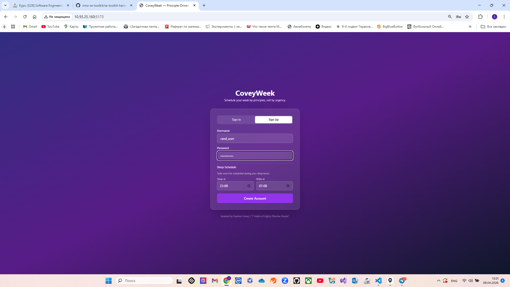
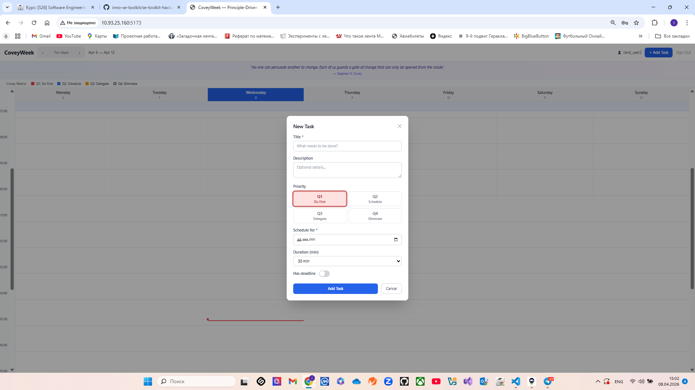
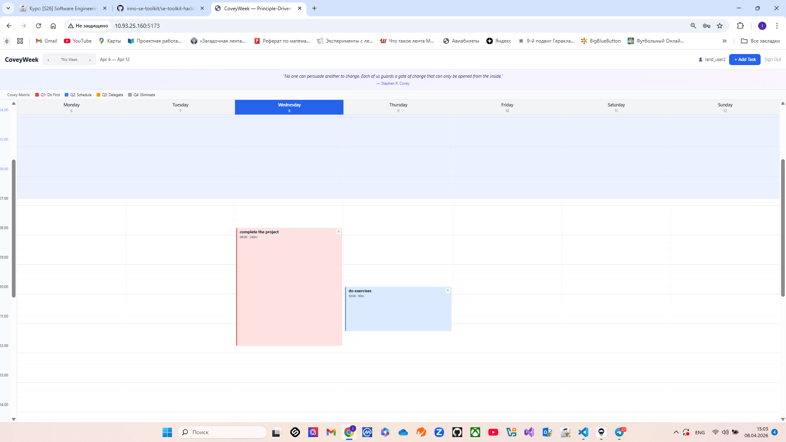
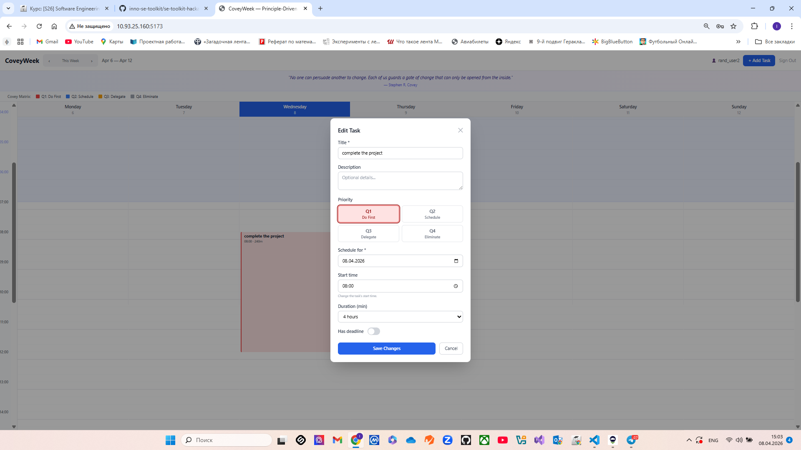

# CoveyWeek

> *A principle-driven weekly planner inspired by Stephen Covey's "7 Habits of Highly Effective People".*

---

## Demo

### Sign Up Form


### Task Creation


### Weekly View


### Task edit


---

## Context

### End Users
Students and young professionals who want to manage their time based on principles, not just urgency.

### Problem
Most task planners sort tasks by deadline alone, causing people to confuse **urgent** with **important**. This leads to burnout and neglect of long-term goals.

### Our Solution
CoveyWeek lets users manually assign each task to one of four Covey quadrants (Q1–Q4), then auto-schedules them on a weekly timeline at the right time of day.
---

## Features

### ✅ Implemented (Version 2)
- **Sleep Schedule** — Tasks are never scheduled during sleep hours
- **Manual Quadrant Selection** — Choose Q1–Q4 at creation; quadrant never auto-changes
- **Auto-Scheduling** — Tasks placed at quadrant base times: Q1 → 08:00, Q2 → 10:00, Q3 → 14:00, Q4 → 16:00
- **Daily Overflow** — If a day exceeds 12 hours, tasks move to the next day
- **Weekly Calendar View** — 7 days × 96 time slots (15-min resolution)
- **Color-Coded Tasks** — Red (Q1), Blue (Q2), Amber (Q3), Gray (Q4)
- **Week Navigation** — Previous / Next week + "Today" button
- **Deadline Support** — Optional date + time per task
- **AI Similarity Warnings** — LLM-based warnings when a task has a different priority than a similar past task (via qwen-code-api proxy)
- **Covey Quotes Banner** — 18 verified quotes from the book
- **Dockerized** — Backend, Frontend, PostgreSQL in Docker Compose

### 🔜 Not Yet Implemented
- Telegram bot for quick task management
- Mobile App

---

## Usage

1. Open the app in your browser
2. **Register** with a username, password, and your sleep schedule
3. **Create tasks** — choose a quadrant (Q1–Q4), optional deadline, and duration
4. Tasks are placed at the quadrant's base time on your chosen day
5. If the day exceeds 12 hours, new tasks overflow to the next day
6. Navigate between weeks with `‹` / `›` buttons
7. Click a task to edit or click `✕` to delete

---

## Deployment

### OS
Ubuntu 24.04

### Prerequisites
```bash
sudo apt update
sudo apt install -y git docker.io docker-compose-v2
sudo systemctl enable --now docker
```

> **Note:** If you get a `containerd` conflict, run `sudo apt remove -y containerd && sudo apt autoremove` before installing `docker.io`.

### Step-by-Step

```bash
# 1. Clone the repository
cd ~
git clone https://github.com/IvanGuzhov822/se-toolkit-hackathon.git
cd se-toolkit-hackathon

# 2. Start all services
docker compose up -d

# 3. Verify
docker compose ps
curl http://localhost:8000/api/health
```

### Services

| Service | URL |
|---------|-----|
| Frontend | http://localhost:5173 |
| Backend API | http://localhost:8000 |
| Swagger Docs | http://localhost:8000/docs |
| PostgreSQL | localhost:5432 |

### Useful Commands

```bash
# View logs
docker compose logs -f backend

# Restart backend
docker compose restart backend

# Full reset (deletes all data)
docker compose down -v && docker compose up -d
```

### Local Development (Frontend Only)

If you want to run the frontend locally (for development) while the backend runs in Docker:

```bash
# 1. Start backend + database in Docker
docker compose up -d backend postgres

# 2. Install frontend dependencies
cd frontend
npm install

# 3. Run the dev server
npm run dev

# Frontend will be available at http://localhost:5173
# It proxies API requests to the Docker backend at http://localhost:8000
```

---


